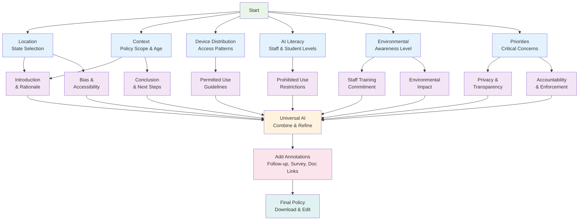

# AI Policy Generation Flow

## Process Overview

1. **Parallel Input Collection**: 6 different input categories are collected simultaneously
2. **Parallel Section Generation**: Each input feeds into relevant policy sections (9 total sections)
3. **Universal AI Convergence**: All sections are combined and refined by a single AI model
4. **Annotation Addition**: Interactive tags are added for customization and linking
5. **Final Output**: Downloadable, editable policy with professional formatting 